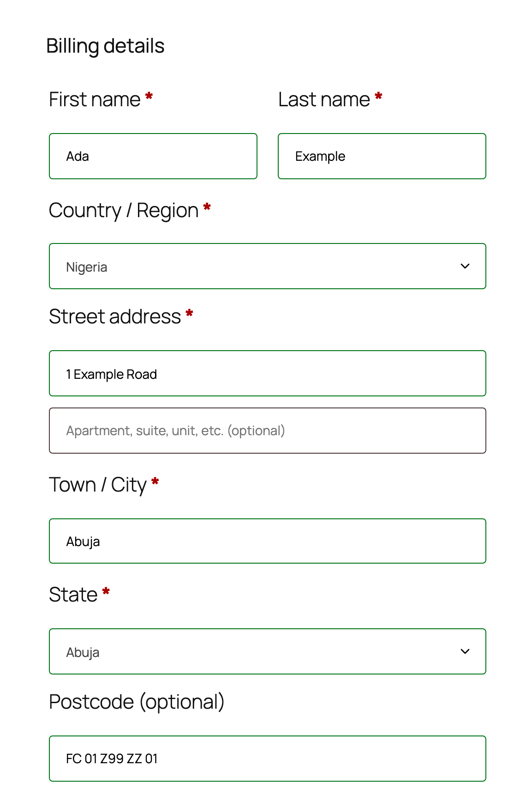

  <picture>
    <source media="(prefers-color-scheme: dark)" srcset="https://raw.githubusercontent.com/gatepost-dev/.github/main/brand/gatepost-lockup-dark.svg">
    
  </picture>

<h1 align="center">Gatepost Postcode for WooCommerce</h1>

Check Nigeria's digital postcodes in the WooCommerce checkout.

  
  

  <a href="https://gatepost-dev.github.io/docs/">Docs</a> ·
  <a href="https://gatepost-dev.github.io/docs/playground/">Playground</a> ·
  <a href="https://github.com/gatepost-dev/.github/blob/main/CONTRIBUTING.md">Contributing</a> ·
  <a href="https://github.com/gatepost-dev/woocommerce/discussions">Discussions</a>

> Unofficial. Not made or endorsed by NIPOST.

A customer with a Nigerian address sees a Postcode field in both checkouts. The order keeps the postcode in its standard form, such as `FC-01-Z99-ZZ-01`.

## What it does

- Shows a postcode field for Nigerian addresses only, in the classic checkout and in the checkout block.
- Checks the format at checkout, names the problem, and suggests a fix for common typos.
- Accepts or rejects old 6-digit postcodes, as the store chooses.
- Looks up each postcode with the store's own NIPOST key after the order. A failed lookup never stops an order.
- Copies the postcode into the order address, and shows it in the orders list, with order tables (HPOS) on or off.

## Requirements

| Requirement | Version       |
| ----------- | ------------- |
| PHP         | 8.1 or later  |
| WordPress   | 6.7 or later  |
| WooCommerce | 10.0 or later |

## Install

> The plugin has no release yet, and it is not on WordPress.org. There is no zip to download today.

To try it now, run `composer install` and `scripts/build-zip` in a clone. The script writes `dist/gatepost-postcode-for-woocommerce.zip`. Then, in WordPress, go to Plugins > Add New Plugin > Upload Plugin, and upload the zip.

## Set up

1. Activate WooCommerce 10.0 or later, then this plugin.
2. Open WooCommerce > Settings > Advanced > Nigerian postcodes.
3. Choose whether the field is required, and what to do with old 6-digit postcodes.
4. To look up each postcode, enter your live secret key from NIPOST. It starts with `nipost_live_`. The plugin does not issue keys.

The format check works without a key. It runs on your server and sends nothing to NIPOST.

## What the plugin sends to NIPOST

Nothing, unless you enter a live secret key and keep the lookup setting on. Then the plugin sends one request to `https://api.postcode.gov.ng` for each different postcode of an order, after the customer places the order.

- The request holds the postcode in its standard form, and your secret key in the `X-API-Key` header.
- The plugin sends no name, email address or other part of the address. It never sends an old 6-digit postcode.
- NIPOST also sees the IP address of your server.
- The plugin never retries by itself. A payment retry sends only a postcode that has no answer yet, or that changed.

[`readme.txt`](readme.txt) holds the full text, in its "External services" section. Read NIPOST's [terms of use](https://postcode.gov.ng/terms), [acceptable use policy](https://postcode.gov.ng/acceptable-use) and [privacy policy](https://postcode.gov.ng/privacy) before you enter a key.

## Docs

[`readme.txt`](readme.txt) holds the WordPress.org listing. [`docs/adr/`](docs/adr) holds the decisions behind the plugin.

## Support

Ask questions in [Discussions](https://github.com/gatepost-dev/woocommerce/discussions). Report bugs in [Issues](https://github.com/gatepost-dev/woocommerce/issues). Report security problems in the [private form](https://github.com/gatepost-dev/woocommerce/security/advisories/new). The [security policy](https://github.com/gatepost-dev/.github/blob/main/SECURITY.md) says how we handle them.

## Contributing

Develop: read the [contributing guide](https://github.com/gatepost-dev/.github/blob/main/CONTRIBUTING.md), then run `scripts/install-wp`, `composer check` and `corepack pnpm test:e2e`. None of them needs Docker.

## Licence

Apache-2.0. See `LICENSE` and `NOTICE`.
